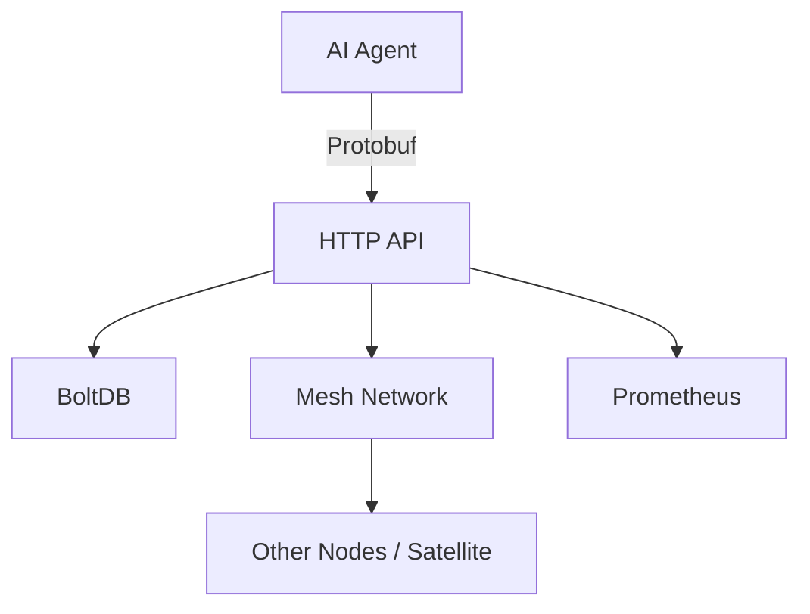

# Spectral-Cloud Architecture

Spectral-Cloud provides a **decentralized, edge-first hosting layer** purpose-built for sovereign AI agents (such as Zenith). It runs efficiently on consumer-grade hardware while offering optional high-speed satellite backhaul for resilience and reach.

The system is intentionally lightweight, observable, and secure by default.

## High-Level Overview

```
Sovereign AI Agent (e.g. Zenith)
                           │
                           ▼
                HTTP Control Plane + Protobuf
                           │
             ┌─────────────┼─────────────┐
             │             │             │
        Mesh Network   BoltDB Store   Observability
       (UDP Overlay)    (Persistence)   (Prometheus)
             │             │             │
             └─────────────┼─────────────┘
                           ▼
                   Local Consumer Hardware
                 (with optional satellite uplink)
```

## Core Principles
- **Edge-first**: Low-latency execution on local nodes.
- **Sovereign**: Minimal (or zero) dependency on centralized cloud providers.
- **Resilient**: Mesh provides automatic rerouting; satellite acts as fallback/backhaul.
- **Observable**: Everything is instrumented for Prometheus + Alertmanager.
- **Secure**: HMAC-signed control messages, tiered API keys, rate limiting, and admin restrictions.

## Components

### 1. UDP Mesh Network (`pkg/mesh`)
- **Purpose**: Provides low-latency, peer-to-peer communication between nodes.
- **Transport**: UDP with custom overlay routing.
- **Key Mechanisms**:
  - Peer discovery via configured `MESH_PEERS` list (static for now).
  - HMAC-signed heartbeats using `MESH_SHARED_KEY` (or per-peer keys).
  - Dynamic route table with TTL (`MESH_ROUTE_TTL`).
  - Anomaly detection: tracks reject rates and burst thresholds over a sliding window.
  - Route management: supports adding routes with latency/throughput metadata.
- **Satellite Integration**: Designed so the mesh can treat high-speed satellite links as preferred high-bandwidth routes (future enhancement: automatic cost-based routing).
- **Current Status**: Disabled by default (`MESH_ENABLE=false`). When enabled, binds to `MESH_UDP_BIND` (default `:7000`).

### 2. HTTP Control Plane + Protobuf API
- Lightweight HTTP server (default port 8080, optional TLS).
- Fine-grained authentication tiers:
  - Public paths (e.g. `/health`)
  - Standard API key
  - Write key
  - Admin keys (with CIDR allowlist support)
- Key endpoints:
  - `/proto/data` — Accepts `DataMessage` (protobuf), returns ACK.
  - `/proto/control` — Accepts `ControlMessage` (protobuf), returns JSON summary.
  - `/blockchain/add` — Append-only transaction log (basic validation + truncation on invalid block).
  - `/routes` — View and manage mesh routes.
  - `/admin/*` — Status, mesh stats, backup/compaction info.
- Protobuf definitions live in `proto/` and are generated via `./scripts/gen-proto.sh`.

### 3. Persistence Layer (`pkg/store`)
- **Primary Store**: BoltDB (`spectral.db`).
- Features:
  - Automatic migration from legacy JSON files on startup.
  - Scheduled encrypted backups (`BACKUP_KEY_B64`).
  - Scheduled compaction with retention policy.
  - Validation and repair tooling via `spectralctl`.
- Blockchain-style append-only log for agent actions/transactions (simple validation only — not a full consensus blockchain).

### 4. Observability
- Prometheus metrics endpoint (`/metrics`).
- Pre-defined alerts in `prometheus/alerts.yml`.
- Alertmanager integration (included in `docker-compose.yml`).
- Mesh-specific metrics: heartbeat success rate, anomaly state, route count, reject rates.

### 5. CLI Tooling (`cmd/spectralctl`)
- `validate` / `repair`
- `backup` (with encryption support)
- `compact` (in-place or to new file)
- `keygen` / `rekey`
- Essential for production maintenance on edge nodes.

## Data Flow Example (AI Agent Interaction)

1. Zenith agent (running locally or on another mesh node) sends a `DataMessage` via `POST /proto/data`.
2. Server authenticates the request, rate-limits if needed, then persists relevant data to BoltDB.
3. If mesh is enabled, the message can be forwarded/routed to other nodes based on destination.
4. Response (ACK or control summary) is returned.
5. All actions are logged, metrics are updated, and anomalies (if any) are flagged.

## Security Model

- All mesh control messages are HMAC-signed.
- HTTP API supports multiple key tiers and path-based ACLs.
- Admin endpoints can be restricted to localhost or specific CIDRs.
- Encrypted backups with user-provided key.
- Rate limiting on all endpoints.

## Deployment Models

- **Bare Metal / Single Node**: `go run ./cmd/spectral-cloud`
- **Docker**: `docker compose up --build` (includes Prometheus + Alertmanager)
- **Kubernetes**: Helm chart in `spectral-cloud/`

## Future Directions

- Dynamic peer discovery (mDNS / gossip).
- Better satellite-aware routing (latency vs bandwidth cost).
- Agent registration and discovery service within the mesh.
- Full gossip protocol for route propagation.
- Enhanced blockchain-style verifiable logging with signatures.
- Mesh simulation / e2e testing framework.

## Diagrams


